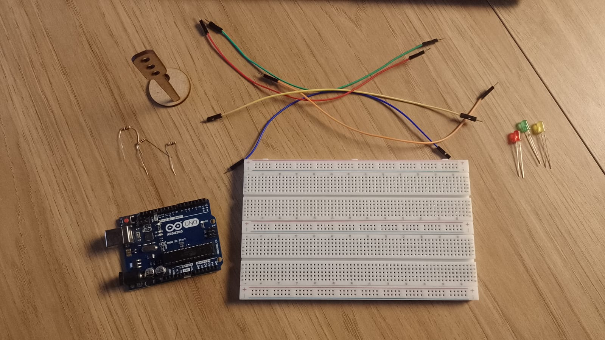
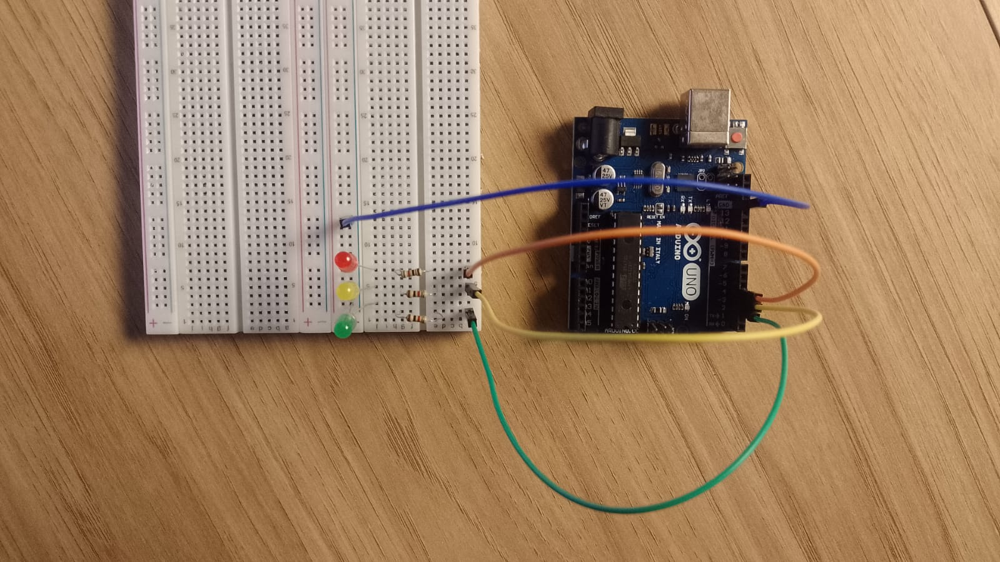
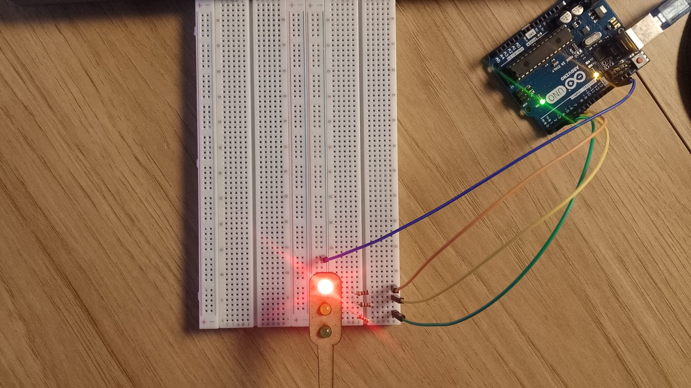

# 🚦 Projeto: Sistema de Controle de Semáforo (POO + Ponteiros)

**Nome:** Vinícius Rangel Marques dos Santos
**Turma:** T18

## Descrição Geral

Este projeto tem como objetivo desenvolver e programar um **sistema de semáforo funcional** utilizando a **Arduino UNO**.  
O sistema foi estruturado com **Programação Orientada a Objetos (POO)** e uso de **ponteiros** para ilustrar conceitos de alocação dinâmica e encapsulamento em C++.  

A proposta é simular o comportamento de um semáforo real — controlando LEDs vermelho, amarelo e verde — com temporizações específicas e controle cíclico contínuo.

---

## Objetivos do Projeto

- Simular o funcionamento de um **semáforo veicular** usando LEDs e resistores.
- Implementar o controle das luzes via **POO + ponteiros**, demonstrando modularidade e alocação dinâmica.
- Documentar o funcionamento e justificar as decisões de design do sistema.

---

##  Hardware Utilizado

| Componente | Quantidade | Descrição | Observação |
|-------------|-------------|-----------|-------------|
| **Arduino UNO** | 1 | Microcontrolador | GPIOs configuráveis |
| **LED Vermelho** | 1 | Indica “Pare” | Conectado ao GPIO 4 |
| **LED Amarelo** | 1 | Indica “Atenção” | Conectado ao GPIO 3 |
| **LED Verde** | 1 | Indica “Siga” | Conectado ao GPIO 2 |
| **Resistores 220Ω** | 3 | Proteção dos LEDs | Um para cada LED |
| **Protoboard** | 1 | Montagem física dos componentes | — |
| **Jumpers** | Vários | Conexões entre pinos | — |
| **Fonte 5V (USB)** | 1 | Alimentação da ESP32 | — |

---

**Ligações recomendadas:**

| LED | Pino GPIO (ESP32) | Conexão | Resistência |
|------|------------------|----------|--------------|
| Vermelho | GPIO 4 | LED → Resistor → GND | 220Ω |
| Amarelo | GPIO 3 | LED → Resistor → GND | 220Ω |
| Verde | GPIO 2 | LED → Resistor → GND | 220Ω |

### Código-Fonte (POO + Ponteiros)

```jsx
// Classe: Semaforo

class Semaforo {
  private:
    int pinoVermelho;
    int pinoAmarelo;
    int pinoVerde;

    int tempoVermelho;
    int tempoAmarelo;
    int tempoVerde;

  public:
    // Construtor — define pinos e tempos
    Semaforo(int vermelho, int amarelo, int verde, int tVermelho, int tAmarelo, int tVerde) {
      pinoVermelho = vermelho;
      pinoAmarelo = amarelo;
      pinoVerde = verde;
      tempoVermelho = tVermelho;
      tempoAmarelo = tAmarelo;
      tempoVerde = tVerde;
    }

    // Inicializa os pinos
    void iniciar() {
      pinMode(pinoVermelho, OUTPUT);
      pinMode(pinoAmarelo, OUTPUT);
      pinMode(pinoVerde, OUTPUT);
    }

    // Liga apenas uma luz
    void acenderSomente(int pinoLigado) {
      digitalWrite(pinoVermelho, LOW);
      digitalWrite(pinoAmarelo, LOW);
      digitalWrite(pinoVerde, LOW);
      digitalWrite(pinoLigado, HIGH);
    }

    // Executa o ciclo completo
    void executarCiclo() {
      // Verde
      acenderSomente(pinoVerde);
      delay(tempoVerde);

      // Amarelo
      acenderSomente(pinoAmarelo);
      delay(tempoAmarelo);

      // Vermelho
      acenderSomente(pinoVermelho);
      delay(tempoVermelho);
    }
};

//Programa Principal

// Ponteiro para objeto da classe Semaforo
Semaforo *ptrSemaforo;

void setup() {
  // Cria o objeto dinamicamente
  ptrSemaforo = new Semaforo(4, 3, 2, 6000, 2000, 4000);
  // (vermelho, amarelo, verde, tempo vermelho, amarelo, verde)
  
  ptrSemaforo->iniciar();
}

void loop() {
  // Executa o ciclo via ponteiro
  ptrSemaforo->executarCiclo();
}
```

### Explicação Didática

| Conceito                     | Aplicação no Projeto                                                                                 |
| ---------------------------- | ---------------------------------------------------------------------------------------------------- |
| **Classe `Semaforo`**        | Modela o comportamento do semáforo.                                                                  |
| **Encapsulamento**           | Os atributos são privados; acessados apenas por métodos internos.                                    |
| **Construtor**               | Define parâmetros (pinos e tempos) ao criar o objeto.                                                |
| **Métodos públicos**         | `iniciar()`, `acenderSomente()` e `executarCiclo()` controlam as luzes.                              |
| **Ponteiro (`ptrSemaforo`)** | Aponta para um objeto criado dinamicamente com `new`.                                                |
| **Operador `->`**            | Usado para acessar métodos e atributos via ponteiro.                                                 |
| **Alocação dinâmica**        | Permite criar e destruir semáforos em tempo de execução, útil em sistemas com múltiplos cruzamentos. |

## Lógica de Funcionamento

| Cor         | Duração    | Ação                        |
| ----------- | ---------- | --------------------------- |
| 🟩 Verde    | 4 segundos | Libera passagem de veículos |
| 🟨 Amarelo  | 2 segundos | Aviso de transição          |
| 🟥 Vermelho | 6 segundos | Bloqueia passagem           |

O ciclo se repete como um semáforo real.

## Registros de Desenvolvimento

Acesse o vídeo de funcionamento no seguinte Link: [Drive](https://drive.google.com/drive/folders/1up6c_5RwUF4Ps7yW7EPieVjXl-YxNw8N?usp=sharing)

<div align="center">
    <strong style="font-size: 18px;"><sub>Materiais Utilizados </sub></strong><br>
<br>
    <sup>Fonte: Desenvolvido pelo Autor</sup>
  </div>

<div align="center">
    <strong style="font-size: 18px;"><sub>Montagem nas portas corretas </sub></strong><br>
<br>
    <sup>Fonte: Desenvolvido pelo Autor</sup>
  </div>

<div align="center">
    <strong style="font-size: 18px;"><sub> Desenvolvimento Final</sub></strong><br>
<br>
    <sup>Fonte: Desenvolvido pelo Autor</sup>
  </div>

